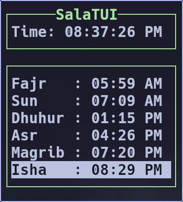

# salatui

[](https://crates.io/crates/salatui)
[](LICENSE)

A terminal UI for Islamic prayer times, written in Rust.

`salatui` shows today's (and any other day's) prayer times in the terminal
with mouse and keyboard support. It ships with everything needed out of the
box via two data backends — an astronomical calculation engine and the full
Maldivian prayer-times dataset built right into the binary — plus desktop
notifications and scriptable output for use in bars, widgets, and scripts.

It is the successor to the [SalatMV](https://github.com/Quicksilver151/SalatMV)
command-line app, which is now deprecated (see below).

## Screenshots



_Work in progress — a menu screenshot will be added here._

## Releases / Installing

Install from [crates.io](https://crates.io/crates/salatui):

```sh
cargo install salatui --locked     # build from source
cargo binstall salatui --no-confirm  # prebuilt binary (fastest)
```

Prebuilt binaries for Linux (x86_64 & aarch64, glibc ≥ 2.17), macOS (x86_64 &
arm64), and Windows (x86_64) are built by GitHub Actions on every release tag.
Release notes and assets are published on
[GitHub Releases](https://github.com/Quicksilver151/salatui/releases).

Quick start:

```sh
salatui                 # interactive TUI
salatui --output        # print today's times once and exit, then quit
salatui --config path   # use a specific config file
```

The configuration file lives at `~/.config/salatui/config-dev.toml`
(dev builds) / `config.toml` (releases), and can be edited in-app or by hand.

## Features

### Data backends

| Backend | Description |
|---------|-------------|
| **Calculation** | Astronomical computation via the [`salah`](https://crates.io/crates/salah) crate. 12 calculation methods (Muslim World League, Egyptian, Karachi, Umm Al-Qura, Dubai, Moonsighting Committee, North America, Kuwait, Qatar, Singapore, Tehran, Turkey), Shafi/Hanafi madhab, and any location — pick from 34,000+ embedded world cities or enter coordinates directly. |
| **Salat MV (built-in)** | The complete Maldivian dataset (originally from the [SalatMV Android app](https://jamiyyathsalaf.com/salatmv)) is embedded at compile time: 20 atolls / 205 islands with day-exact prayer tables for the whole year. Select any island from the built-in picker. |

### Interface

- Full TUI with mouse and keyboard input (menu + settings screens)
- Day navigation with `←`/`→`, month navigation with `Shift`+`←`/`→`
- Current-prayer indicator, live clock with seconds, configurable location line
- Settings editor with live autosave and instant provider reload
- City and island pickers with fuzzy (subsequence) filtering
- Desktop notifications per prayer with configurable offset (minutes)
- CLI output modes for scripting: `pretty-json`, `json`, `array`, `raw`, custom, `toml`

## Dependencies

Runtime dependencies and what they provide:

| Crate | Role |
|-------|------|
| [`ratatui`](https://crates.io/crates/ratatui) + [`crossterm`](https://crates.io/crates/crossterm) | Terminal UI rendering and input |
| [`salah`](https://crates.io/crates/salah) | Prayer-time calculations |
| [`notify-rust`](https://crates.io/crates/notify-rust) | Desktop notifications — on Linux this requires a notification daemon over D-Bus (e.g. `dunst`, `mako`, or a desktop shell such as GNOME Shell / KDE Plasma) |
| [`confy`](https://crates.io/crates/confy) | Config load/save |
| [`clap`](https://crates.io/crates/clap) | Command-line arguments |
| [`chrono`](https://crates.io/crates/chrono) / [`time`](https://crates.io/crates/time) | Date/time handling |

All datasets ship inside the binary — no network access at runtime.

## Compiling

Build a release binary:

```sh
git clone https://github.com/Quicksilver151/salatui
cd salatui
cargo build --release
# binary at target/release/salatui
```

All data (Maldivian prayer tables and GeoNames city list) is embedded at
build time from the committed `data/` directory; the build requires no network
and no external tooling beyond a [current Rust toolchain](https://rustup.rs).

## SalatMV deprecation

[SalatMV](https://github.com/Quicksilver151/SalatMV) — the command-line
predecessor of this project — has been deprecated and superseded by
**salatui**. The Maldivian prayer-times dataset lives on here, embedded in
the binary and selectable through the `Salat MV` provider.

## AI use disclosure

This project was developed with the assistance of an AI coding agent
(opencode), which wrote a significant portion of the code under human
direction and review. The AI's involvement was strongest in the settings
configuration UI, the in-app data organization, the fuzzy pickers, and the
build-time data pipeline; final design decisions and correctness were owned
and reviewed by the project maintainer.